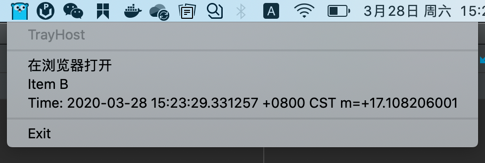
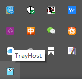
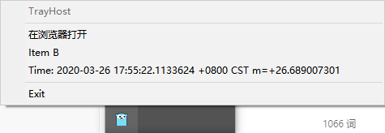

TrayHost
========

本项目在 [https://github.com/overlordtm/trayhost](https://github.com/overlordtm/trayhost) 上进行了修改，对此表示感谢和敬意。


__TrayHost__ is a library for placing a __Go__ application in the task bar (system tray, notification area, or dock) in a consistent manner across multiple platforms. Currently, there is built-in support for __Windows__, __Mac OSX__, and __Linux__ systems that support GTK+2 status icons (including Gnome 2, KDE 4, Cinnamon, MATE and other desktop environments).

The intended usage is for applications that utilize web technology for the user interface, but require access to the client system beyond what is offered in a browser sandbox (for instance, an application that requires access to the user's file system).

The library places a tray icon on the host system's task bar that can be used to open a URL, giving users easy access to the web-based user interface. 

The Interesting Part
----------------------
```go
package main

import (
	"fmt"
	"github.com/sudot/trayhost"
	"net/http"
	"os/exec"
	"runtime"
	"time"
)

func main() {
	// EnterLoop must be called on the OS's main thread
	runtime.LockOSThread()

	// Debug默认是false,在你的实际使用中不需要这一行代码
	trayhost.Debug = true
	trayhost.Initialize("TrayHost", func() {
		fmt.Println("You clicked tray icon")
		openUrl()
	})
	// 通过图片字节数组设置托盘图标
	trayhost.SetIconData(iconData)
	trayhost.SetMenu(trayhost.MenuItems{
		trayhost.NewMenuItemDisabled("TrayHost"),
		trayhost.NewMenuItemDivided(),
		trayhost.NewMenuItem("在浏览器打开", openUrl),
		trayhost.NewMenuItem("Item B", nil),
		trayhost.NewMenuItem(fmt.Sprintf("Time: %v", time.Now()), nil),
		trayhost.NewMenuItemDivided(),
		trayhost.NewMenuItem("Exit", trayhost.Exit),
	})

	go func() {
		// 启动一个 http 服务器
		_ = http.ListenAndServe(":1234", http.HandlerFunc(func(w http.ResponseWriter, r *http.Request) {
			_, _ = w.Write([]byte("TrayHost"))
		}))
	}()

	go func() {
		// 更新菜单项
		for now := range time.Tick(1 * time.Second) {
			trayhost.UpdateMenuItem(4, trayhost.NewMenuItem(fmt.Sprintf("Time: %v", now), nil))
		}
	}()
	go func() {
		// 每10秒更换两次托盘图标
		for _ = range time.Tick(10 * time.Second) {
			// 通过图片路径设置托盘图标
			trayhost.SetIconPath("example/icons/go.ico")
			time.Sleep(5 * time.Second)
			// 通过图片字节数组设置托盘图标
			trayhost.SetIconData(iconData)
		}
	}()

	// Enter the host system's event loop
	trayhost.EnterLoop()

	fmt.Println("Exiting")
}

func openUrl() {
	var commands = map[string]string{
		"windows": "explorer",
		"darwin":  "open",
		"linux":   "xdg-open",
	}
	run, _ := commands[runtime.GOOS]
	_ = exec.Command(run, "http://127.0.0.1:1234").Start()
}

```

以上示例运行截图：

**Mac**



**Windows**






Build Environment
--------------------------

Before continuing, make sure that your GOPATH environment variable is set, and that you have Git and Mercurial installed and that __go__, __git__, and __hg__ are in your PATH.

Cross-compilation is not currently supported, so you will need access to a machine running the platform that you wish to target. 

Generally speaking, make sure that your system is capable of doing [cgo](http://golang.org/doc/articles/c_go_cgo.html) builds.

#### Linux
In addition to the essential GNU build tools, you will need to have the GTK+ 3.0 development headers installed.

#### Windows
To do cgo builds, you will need to install [MinGW](http://www.mingw.org/). In order to prevent the terminal window from appearing when your application runs, you'll need access to a copy of [editbin.exe](http://msdn.microsoft.com/en-us/library/xd3shwhf.aspx) which comes packaged with Microsoft's C/C++ build tools.

#### Mac OSX
__Note__: TrayHost requires __Go 1.1__ when targetting Mac OSX, or linking will fail due to issues with previous versions of Go and Mach-O binaries.

You'll need the "Command Line Tools for Xcode", which can be installed using Xcode. You should be able to run the __cc__ command from a terminal window.

Installing
-----------
Once your build environment is configured, go get the library:

```bash
go get github.com/sudot/trayhost
```

If all goes well, you shouldn't get any errors.

Using
-----

Use the included __example/main.go__ file as a template to get going.  OSX will throw a runtime error if __EnterLoop__ is called on a child thread, so the first thing you must do is lock the OS thread. Your application code will need to run on a child goroutine. __SetUrl__ can be called lazily if you need to take some time to determine what port you are running on. 

Before it will build, you will need to pick an icon for display in the system tray.

#### Generating the Tray Icon
Included in the project is a tool for generating the icon that gets displayed in the system tray. An icon sized 64x64 pixels should suffice, but there aren't any restrictions here as the system will take care of fitting it (just don't get carried away). 

Icons are embedded into the application by generating a Go array containing the byte data using the [2goarray](http://github.com/cratonica/2goarray) tool, which will automatically be installed if it is missing. The generated .go file will be compiled into the output program, so there is no need to distribute the icon with the program. If you want to embed more resources, check out the [embed](http://github.com/cratonica/embed) project.

#### Linux/OSX
From your project root, run __make_icon.sh__, followed by the path to a __PNG__ file to use. For example:

    make_icon.sh example/icons/logo.png

This will generate a file called __iconunix.go__ and set its build options so it won't be built in Windows.

#### Windows
From the project root, run __make_icon.bat__, followed by the path to a __Windows ICO__ file to use. If you need to create an ICO file, the online tool [ConvertICO](http://convertico.com/) can do this painlessly. 

Example:

    make_icon.bat example/icons/logo.ico

This will generate a file called __iconwin.go__ and set its build options so it will only be built in Windows.
    
#### Disabling the Command Prompt Window on Windows
The [editbin](http://msdn.microsoft.com/en-us/library/xd3shwhf.aspx) tool will allow you to change the subsystem of the output executable so that users won't see the command window while your application is running. The easiest way to do this is to open the Visual Studio Command Prompt from the start menu (or, alternatively, find __vcvarsall.bat__ in your Visual Studio installation directory and CALL it passing the __x86__ argument). Once you are in this environment, issue the command:

    editbin.exe /SUBSYSTEM:WINDOWS path\to\program.exe

Now when you run the program, you won't see a terminal window.

API
-----

- `var Debug`

  是否开启调试模式，默认为 `false`。若为 `true` 则会在运行时打印出一些日志信息。

- `type MenuItem struct`

  菜单项结构体。定义如下：

  ```go
  type MenuItem struct {
  	Title    string
  	Disabled bool
  	Handler  func()
  }
  ```

  - `Title    string`

    菜单项的标题。接受任意的字符串内容，若为空字符串，则表示为分割线。

  - `Disabled bool`

    菜单项是否禁用，默认为 `false`。若为 `true` 则表示菜单项被禁用，此菜单项被置灰且点击无回调。

  - `Handler  func()`

    点击菜单项触发的回调函数。

- `type MenuItems []MenuItem`

  菜单集合，用于表示整个菜单的每一个具体项目。

- `func EnterLoop()`

  进入系统事件循环，只有调用此函数后，系统托盘才可以接收点击事件，此函数会阻塞当前进程。

- `func Exit()`

  退出系统，并销毁系统托盘图标，清理产生的临时文件。

- `func Initialize(title string, handler func())`

  初始化系统托盘信息。这应该在调用其他函数前调用，所以它是第一个就应该调用的函数。

  此函数每次调用，都会在托盘区域创建一个新的图标，所以此函数仅调用一次。

- `func NewMenuItem(title string, handler func()) MenuItem`

  快捷创建可点击的新菜单项，支持设置标题和回调函数。

  示例：

  ```go
  trayhost.NewMenuItem("在浏览器打开", fun (){
  	fmt.Println("You clicked tray icon")
  })
  
  trayhost.NewMenuItem("Item B", nil)
  
  trayhost.NewMenuItem("Exit", trayhost.Exit)
  ```

  

- `func NewMenuItemDisabled(title string) MenuItem`

  快捷创建禁用的菜单项，此菜单项会置灰，且点击无回调。

- `func NewMenuItemDivided() MenuItem`

  快捷创建菜单项分隔符。

- `func SetIconPath(iconPth string)`

  设置系统托盘图片的路径，可以是相对路径，相对于系统当前目录。

- `func SetIconData(imageData []byte)`

  设置系统托盘图片的字节数组内容，此字节数组表示了一张图片。

  在调用此函数后会将字节数组在系统临时目录下写入一个临时的图片文件提供给操作系统底层读取，操作完毕后会立刻删除此临时图片。

- `func SetMenu(menu MenuItems)`

  设置系统托盘菜单，此菜单在接收到鼠标右键点击事件后显示出来。

- `func UpdateMenuItem(index int, item MenuItem)`

  更新系统托盘菜单指定的菜单项，在本项目中菜单项是以数组的方式实现，所以 `index`  表示的是菜单项对应的索引，`item` 是一个新的菜单项，此菜单项会完全替换原有的菜单项。